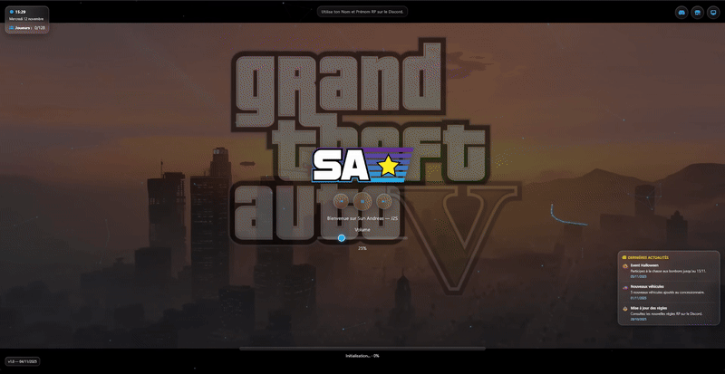

# FiveM Loading Screen

Écran de chargement professionnel et entièrement personnalisable pour serveurs **FiveM Sun Andreas**, développé avec **React** et **Vite**. Conçu pour offrir une expérience immersive et fluide lors du chargement du serveur.

---

## Démonstration

<div align="center">



</div>

---

## Caractéristiques

### Interface

- Design **responsive** adapté à toutes les résolutions (mobile, tablette, desktop)
- Effets **glassmorphism** avec flou d'arrière-plan et transparences
- Transitions fluides et animations CSS optimisées
- Support vidéo de fond (local et hébergé) avec compatibilité YouTube
- Traînée de curseur interactive et effets visuels Canvas

### Fonctionnalités

- **Lecteur audio** : playlist personnalisable avec contrôles de volume et sauvegarde locale
- **Horloge dynamique** : affichage temps réel de l'heure et de la date
- **Actualités** : système de news configurable avec défilement automatique
- **Informations serveur** : intégration Discord, boutique et panel personnalisables
- **Phrases animées** : messages rotatifs en haut de l'écran
- **Contrôles clavier** : raccourcis pour navigation et contrôle audio

### Technique

- Architecture modulaire avec composants React séparés
- Hooks personnalisés pour logique métier réutilisable
- Configuration centralisée 100% personnalisable via fichier unique
- Optimisé pour performances FiveM (chargement rapide, faible empreinte mémoire)
- Code commenté et structuré selon les standards professionnels

---

## Installation

### Prérequis

- Node.js 18+ et npm
- Serveur FiveM configuré

### 1. Cloner et installer

```bash
git clone https://github.com/votre-utilisateur/loading-screen.git
cd loading-screen
cd ui
npm install
```

### 2. Développement local

```bash
npm run dev
```

Accès sur [http://localhost:5173](http://localhost:5173) pour prévisualisation.

### 3. Build production

```bash
npm run build
```

Le dossier `ui/dist/` contient les fichiers optimisés pour FiveM.

### 4. Installation FiveM

Placez l'intégralité du projet dans votre dossier `resources/`, puis ajoutez dans `server.cfg` :

```cfg
ensure loading-screen
```

Le fichier `fxmanifest.lua` est déjà configuré pour pointer vers les bons chemins.

---

## Configuration

Toute la configuration se trouve dans **`ui/src/config.js`**. Personnalisation complète sans toucher au code React.

### Sections configurables

| Section         | Description                                  |
| --------------- | -------------------------------------------- |
| **VIDEOS**      | URLs des vidéos de fond (MP4, WebM, YouTube) |
| **MUSIC**       | Playlist audio avec titres et artistes       |
| **TOP_PHRASES** | Messages rotatifs affichés en haut           |
| **NEWS**        | Actualités avec icônes Font Awesome          |
| **LINKS**       | Discord, boutique, panel (URLs et labels)    |
| **THEME**       | Couleurs primaires, secondaires et accents   |
| **SERVER_INFO** | Nom du serveur et version                    |

Exemple de modification :

```javascript
export const SERVER_INFO = {
  name: "Mon Serveur RP",
  version: "v3.2.1",
};
```

---

## Architecture du projet

```
/
├── ui/                          # Application React
│   ├── dist/                    # Build production (généré)
│   ├── public/                  # Assets statiques
│   ├── src/
│   │   ├── components/          # Composants UI
│   │   │   ├── Clock.jsx
│   │   │   ├── MusicPlayer.jsx
│   │   │   ├── NewsPanel.jsx
│   │   │   ├── VideoBackground.jsx
│   │   │   └── ...
│   │   ├── hooks/               # Logique métier réutilisable
│   │   │   ├── useAudioPlayer.js
│   │   │   ├── useClock.js
│   │   │   ├── useNUIMessages.js
│   │   │   └── ...
│   │   ├── config.js            # Configuration centralisée
│   │   ├── constants.js         # Constantes globales
│   │   ├── App.jsx              # Composant principal
│   │   └── main.jsx             # Point d'entrée
│   ├── package.json
│   ├── vite.config.js
│   └── tailwind.config.js
│
├── fivem/                       # Scripts FiveM
│   └── client.lua               # Gestion lifecycle
│
├── scripts/                     # Scripts utilitaires
│   └── copy-fonts.js            # Copie Font Awesome au build
│
├── assets/                      # Ressources docs
│   └── DEMO.gif
│
├── fxmanifest.lua              # Manifest FiveM
└── README.md
```

---

## Technologies

| Technologie  | Usage                            |
| ------------ | -------------------------------- |
| React 18     | Framework UI avec hooks modernes |
| Vite         | Build tool ultra-rapide          |
| TailwindCSS  | Framework CSS utilitaire         |
| PostCSS      | Traitement CSS avancé            |
| Font Awesome | Bibliothèque d'icônes            |
| Canvas API   | Effets visuels particules        |

---

## Compatibilité

- FiveM
- Navigateurs modernes (Chrome, Firefox, Edge)
- Résolutions : 1920x1080 à 3840x2160
- Support mobile et tablette

---

## Performance

- Temps de chargement initial : < 2 secondes
- Utilisation mémoire : ~50MB
- Optimisations : lazy loading, code splitting, assets compressés

---

## Licence

Projet distribué sous licence **MIT**.  
Redistribution et modification autorisées avec conservation des crédits originaux.
