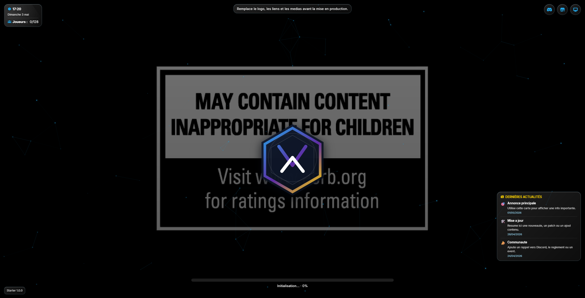
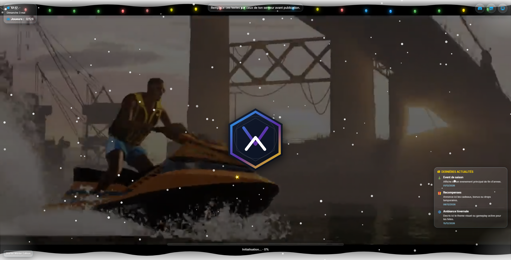

# FiveM Loadscreen Starter

Starter de loading screen FiveM base sur React et Vite, pense pour etre rebrand rapidement sur n'importe quel serveur.

## Apercu

<div align="center">
  
  
</div>

## Fonctionnalites

- Interface responsive avec fond video, lecteur audio optionnel, horloge et panneau d'actualites
- Configuration centralisee dans `ui/src/config/config.js`
- Build frontend pret pour une integration directe dans FiveM

## Installation

```bash
git clone https://github.com/votre-utilisateur/fivem-loadscreen-starter.git
cd fivem-loadscreen-starter/ui
npm install
```

### Developpement local

```bash
npm run dev
```

Preview sur `http://localhost:5173`.

### Build

```bash
npm run build
```

### Integration FiveM

Place la ressource dans ton dossier `resources/`, puis ajoute la ligne adaptee a son nom dans `server.cfg` :

```cfg
ensure nom_de_la_ressource
```

## Personnalisation rapide

Le template se pilote principalement depuis :

- `ui/src/config/config.js` pour le theme principal, les liens, les videos, la musique, les phrases et les news
- `ui/src/assets/logo.svg` pour le logo principal affiche au centre
- `ui/public/logo.svg` pour le favicon
- `ui/public/media/videos/` pour les videos d'exemple
- `ui/public/media/music/` si tu veux ajouter tes propres pistes plus tard

## Arborescence utile

```text
.
|-- assets/
|-- fivem/
|-- scripts/
|-- ui/
|   |-- public/
|   |   `-- media/
|   `-- src/
|       |-- assets/
|       |-- components/
|       `-- config/
|-- fxmanifest.lua
`-- README.md
```

## Avant publication

- Remplace le logo, les liens et les medias d'exemple par ceux de ton serveur
- Ajoute des fichiers dans `ui/public/media/music/` uniquement si tu veux activer la musique
- Adapte les textes de `NEWS` et `TOP_PHRASES` a ton univers
- Remplace `assets/preview-01.png` et `assets/preview-02.png` si tu veux afficher tes propres rendus dans le README

## Licence

Projet sous licence MIT.
